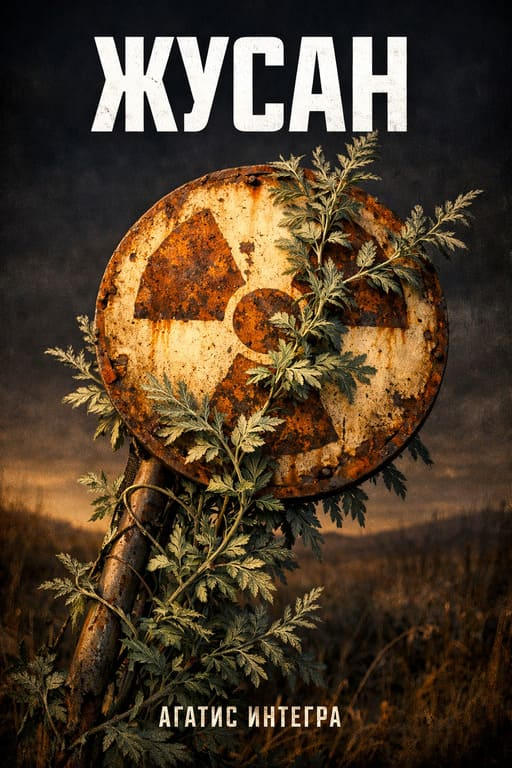

# Жусан — Документация по изображениям

## Обзор

Текущая реализация лендинга полностью на CSS (clip-path силуэты, gradient небо, CSS-анимации).
Ниже — полный список изображений для генерации, промты, технические требования и точные инструкции по интеграции.

**Формат:** PNG (с прозрачностью) для силуэтов и наложений, JPG для фонов и OG-изображений.
**Стиль:** Все изображения должны быть в единой стилистике — минималистичные силуэты, пустынная атмосфера, приглушённые тона. Никакой детализации лиц, только контуры.

---

## Изображение 1: OG-превью (социальные сети)

**Файл:** `zhusan/og-cover.jpg`
**Размер:** 1200×630 px
**Формат:** JPG, качество 85%

### Промт

```
Vast Kazakh steppe at dawn, purple-black sky transitioning to amber horizon.
Low dark mountain silhouettes on the horizon. A single distant industrial
structure (Soviet-era nuclear test site) silhouetted on the right.
Foreground: scattered wormwood (artemisia) plants, low and sparse.
Centered large text "ЖУСАН" in bold serif font, slightly glowing amber.
Cinematic wide composition, desolate post-apocalyptic atmosphere.
Muted color palette: deep purple #1a1520, amber #d4a574, dusty olive #4a5a3a.
No people visible. Film grain texture. Aspect ratio 1.9:1.
```

### Где вставить

**`index.html`** — добавить/обновить мета-теги (строки 15–24):

```html
<!-- Добавить после строки 20 (og:locale) -->
<meta property="og:image" content="https://againte.gratis/zhusan/og-cover.jpg">
<meta property="og:image:alt" content="Жусан — степь на рассвете, силуэт полигона на горизонте">
<meta property="og:image:width" content="1200">
<meta property="og:image:height" content="630">

<!-- Добавить после строки 24 (twitter:description) -->
<meta name="twitter:image" content="https://againte.gratis/zhusan/og-cover.jpg">
<meta name="twitter:image:alt" content="Жусан — степь на рассвете, силуэт полигона на горизонте">
```

---

## Изображение 2: Горная панорама

**Файл:** `zhusan/mountains.png`
**Размер:** 1920×400 px
**Формат:** PNG с прозрачностью (верхняя часть — прозрачная, горы — заливка)

### Промт

```
Silhouette of low Kazakh steppe mountains/hills panorama, completely flat
black fill (#0d0a10), no texture, no detail — only the contour line against
transparent background. Gentle rolling hills, not dramatic peaks.
Spans full width, heights vary between 20% and 65% of image.
Left side: lower hills. Center: medium ridge. Right side: slightly taller.
Style: pure vector silhouette cutout, clean edges, minimal complexity.
Transparent PNG, alpha channel for the sky above the ridge line.
Aspect ratio ~5:1 panoramic.
```

### Где заменить

**`style.css`** — заменить `.mountains` clip-path (строки 107–136):

```css
/* БЫЛО: clip-path polygon */
/* СТАЛО: */
.mountains {
    position: absolute;
    bottom: 0;
    left: 0;
    width: 100%;
    height: 100%;
    background: url('mountains.png') bottom center / cover no-repeat;
    opacity: 0.6;
}
```

---

## Изображение 3: Силуэт полигона (индустриальные сооружения)

**Файл:** `zhusan/polygon.png`
**Размер:** 600×400 px
**Формат:** PNG с прозрачностью

### Промт

```
Silhouette of abandoned Soviet nuclear test site structures, completely flat
dark fill (#050305), no texture — only building contours against transparent
background. Include: a tall monitoring tower/antenna, a squat concrete bunker,
angular industrial buildings with flat roofs, a chimney stack, scattered low
structures. Architectural style: brutalist Soviet 1950s-60s.
Structures clustered together as a compound. Clean sharp edges.
Viewed from ~2km distance so details are lost, just recognizable shapes.
Pure silhouette, transparent PNG, no ground plane.
```

### Где заменить

**`style.css`** — заменить `.polygon-silhouette` clip-path (строки 138–173):

```css
/* БЫЛО: clip-path polygon */
/* СТАЛО: */
.polygon-silhouette {
    position: absolute;
    bottom: 0;
    right: 10%;
    width: 25%;
    height: 60%;
    background: url('polygon.png') bottom center / contain no-repeat;
    opacity: 0.4;
    filter: drop-shadow(0 0 40px var(--glow-color));
}
```

**Примечание:** заменить `box-shadow` на `filter: drop-shadow()` — для PNG drop-shadow обтекает контур, а не прямоугольник.

---

## Изображение 4: Силуэт странника

**Файл:** `zhusan/wanderer.png`
**Размер:** 120×320 px
**Формат:** PNG с прозрачностью

### Промт

```
Full-body silhouette of a lone male wanderer/survivor walking through steppe,
flat dark fill, no texture, no face detail. He wears a heavy coat or poncho,
carries a backpack and a long walking stick in right hand. Posture: slightly
hunched forward, trudging. Hair blown by wind. Thin but sturdy build.
Viewed from side/slight angle. Clean edges, pure vector-style silhouette
against transparent background. Single solid color, no gradients within figure.
Post-apocalyptic traveler aesthetic, not military.
```

### Где заменить

**`style.css`** — заменить `.silhouette--wanderer` clip-path (строки 482–509):

```css
.silhouette--wanderer {
    left: 25%;
    width: 60px;
    height: 160px;
    background: url('wanderer.png') center / contain no-repeat;
    opacity: 0.5;
    /* Убрать clip-path и background: var(--text-muted) */
}
```

**`style.css`** — обновить tablet (строка 824–826):
```css
.silhouette--wanderer {
    width: 45px;
    height: 120px;
}
```

---

## Изображение 5: Силуэт девушки

**Файл:** `zhusan/girl.png`
**Размер:** 115×280 px
**Формат:** PNG с прозрачностью

### Промт

```
Full-body silhouette of a young Kazakh woman standing in steppe, flat dark
fill, no texture, no face detail. She wears a long traditional dress or
a flowing coat reaching below knees, a headscarf or shawl blowing slightly
in wind. Slim build, standing upright, looking toward the distance.
One hand shielding eyes from sun. Viewed from slight angle.
Clean edges, pure vector-style silhouette, transparent background.
Single solid color, no gradients. Dignified, resilient posture.
```

### Где заменить

**`style.css`** — заменить `.silhouette--girl` clip-path (строки 512–532):

```css
.silhouette--girl {
    right: 25%;
    width: 50px;
    height: 140px;
    background: url('girl.png') center / contain no-repeat;
    opacity: 0.5;
    /* Убрать clip-path и background: var(--text-muted) */
}
```

**`style.css`** — обновить tablet (строки 829–831):
```css
.silhouette--girl {
    width: 36px;
    height: 100px;
}
```

---

## Изображение 6: Силуэт зданий гарнизона

**Файл:** `zhusan/garrison.png`
**Размер:** 800×320 px
**Формат:** PNG с прозрачностью

### Промт

```
Silhouette of a small Soviet military garrison compound, flat dark fill,
no texture, against transparent background. Include: a two-story barracks
building with flat roof, a watchtower with observation platform, a low
supply warehouse, a gate/checkpoint structure, a flagpole (flag absent).
All buildings connected by a low perimeter wall/fence.
Brutalist Soviet military architecture, 1960s era. Slightly worn/damaged —
some roof sections missing, antenna tilted. Viewed from ~500m distance,
ground level. Clean sharp edges, pure silhouette, no details inside buildings.
Horizontal composition, buildings spread across width.
```

### Где заменить

**`style.css`** — заменить `.silhouette--buildings` clip-path (строки 535–568):

```css
.silhouette--buildings {
    left: 10%;
    width: 250px;
    height: 100px;
    background: url('garrison.png') bottom center / contain no-repeat;
    opacity: 0.3;
    /* Убрать clip-path и background: var(--text-muted) */
}
```

**`style.css`** — обновить tablet (строки 819–822):
```css
.silhouette--buildings {
    width: 180px;
    height: 75px;
}
```

---

## Изображение 7: Силуэт командира

**Файл:** `zhusan/commander.png`
**Размер:** 140×340 px
**Формат:** PNG с прозрачностью

### Промт

```
Full-body silhouette of a military commander standing at attention, flat dark
fill, no texture, no face detail. Wears a Soviet-style officer's greatcoat,
officer's cap (фуражка), hands clasped behind back or one hand on holster.
Slightly taller and broader than average, confident straight posture.
Boots, belt visible in outline. No weapons drawn.
Viewed from front/slight angle. Clean edges, pure vector-style silhouette,
transparent background. Single solid color. Authoritative, stern stance.
```

### Где заменить

**`style.css`** — заменить `.silhouette--commander` clip-path (строки 571–599):

```css
.silhouette--commander {
    right: 15%;
    width: 60px;
    height: 170px;
    background: url('commander.png') center / contain no-repeat;
    opacity: 0.5;
    /* Убрать clip-path и background: var(--text-muted) */
}
```

**`style.css`** — обновить tablet (строки 834–837):
```css
.silhouette--commander {
    width: 45px;
    height: 130px;
}
```

---

## Изображение 8: Загадочный силуэт (ночная секция)

**Файл:** `zhusan/mysterious.png`
**Размер:** 160×400 px
**Формат:** PNG с прозрачностью

### Промт

```
Full-body silhouette of a mysterious humanoid figure standing still, flat dark
fill, no texture, against transparent background. Ambiguous form — could be
human or something else. Wearing long flowing robes or cloak that reaches the
ground, obscuring body shape. No visible face, head slightly bowed.
Arms not visible — hidden inside robes. Slightly elongated proportions,
uncanny and unsettling. Edges of cloak slightly frayed or dissolving into
wisps (as if affected by radiation or decay). Eerie, otherworldly presence.
Clean silhouette, mostly sharp edges but bottom of cloak fragmenting.
No color inside figure except solid dark, transparent background.
```

### Где заменить

**`style.css`** — заменить `.silhouette--mysterious` clip-path (строки 602–626):

```css
.silhouette--mysterious {
    width: 60px;
    height: 180px;
    margin: 2rem auto;
    position: relative;
    background: url('mysterious.png') center / contain no-repeat;
    opacity: 0;
    transform: translateY(10px);
    transition: opacity 2s ease, transform 2s ease;
    filter: drop-shadow(0 0 30px var(--glow-color)) drop-shadow(0 0 60px var(--glow-color));
    /* Убрать clip-path, background: var(--text-muted), box-shadow */
}
```

**`style.css`** — обновить tablet (строки 839–842):
```css
.silhouette--mysterious {
    width: 45px;
    height: 135px;
}
```

**`style.css`** — обновить mobile (строки 883–886):
```css
.silhouette--mysterious {
    width: 42px;
    height: 126px;
    /* Убрать transform: scale(0.7) — размеры уже уменьшены */
}
```

---

## Изображение 9: Текстура полыни (опционально, для wormwood-divider)

**Файл:** `zhusan/wormwood-sprig.png`
**Размер:** 60×60 px
**Формат:** PNG с прозрачностью

### Промт

```
Tiny minimalist botanical illustration of a single wormwood (artemisia /
полынь) sprig viewed from above, flat style. 3-4 small lobed grey-green
leaves on a thin stem. Colors: muted olive green #4a5a3a on transparent
background. No shadow, no 3D effect, flat vector style.
Clean simple shape suitable for small decorative element. Icon-sized.
```

### Где вставить

**`style.css`** — заменить `.wormwood-divider::before` (строки 691–702):

```css
.wormwood-divider::before {
    content: '';
    position: absolute;
    top: -25px;
    left: 50%;
    transform: translateX(-50%);
    width: 50px;
    height: 50px;
    background: url('wormwood-sprig.png') center / contain no-repeat;
    opacity: 0.5;
    /* Убрать border-radius, box-shadow, старые размеры */
}
```

---

## Изображение 10: Обложка книги (для будущего CTA)

**Файл:** `zhusan/cover.jpg`
**Размер:** 800×1200 px (соотношение 2:3, стандарт книжных обложек)
**Формат:** JPG, качество 90%

### Промт

```
Book cover design for post-apocalyptic novel "ЖУСАН" (Wormwood).
Top half: vast Kazakh steppe under a dramatic sky — purple-amber dawn
transitioning to dark. Low mountain silhouettes on horizon.
Center: title "ЖУСАН" in large bold serif Cyrillic letters, slightly
distressed/textured, amber-white color with subtle glow.
Bottom half: close-up of wormwood (artemisia) plants in foreground,
grey-green, slightly glowing with unnatural faint green light.
In the far distance, barely visible: angular silhouette of Soviet nuclear
test site structures.
Author name "АГАТИС ИНТЕГРА" in small clean sans-serif at bottom.
Color palette: deep purple (#1a1520), amber (#d4a574), olive (#4a5a3a),
toxic green (#2a4a1a). Atmospheric, desolate, haunting.
Style: cinematic photo-realistic with film grain.
Portrait orientation, aspect ratio 2:3.
```

### Где вставить

Обложка пока не отображается на лендинге (книга не опубликована).
Когда будет готова — добавить в секцию `scene--end`:

**`index.html`** — перед кнопкой CTA (перед строкой 163):

```html

```

**`style.css`** — добавить стили:

```css
.book-cover {
    display: block;
    margin: 0 auto 2rem;
    width: clamp(180px, 30vw, 280px);
    height: auto;
    border: 1px solid rgba(168, 152, 128, 0.3);
    box-shadow: 0 10px 40px rgba(0, 0, 0, 0.5);
    opacity: 0;
    transform: translateY(20px);
    transition: opacity 1.5s ease, transform 1.5s ease;
}
```

**`index.html`** — обновить Schema.org (строки 31–46), добавить:

```json
"image": "https://againte.gratis/zhusan/cover.jpg",
"thumbnailUrl": "https://againte.gratis/zhusan/cover.jpg"
```

---

## Сводная таблица

| #  | Файл              | Размер px   | Формат | Приоритет | Заменяет            |
|----|--------------------|-------------|--------|-----------|---------------------|
| 1  | og-cover.jpg       | 1200×630    | JPG    | Высокий   | Нет (новое)         |
| 2  | mountains.png      | 1920×400    | PNG    | Высокий   | CSS clip-path       |
| 3  | polygon.png        | 600×400     | PNG    | Высокий   | CSS clip-path       |
| 4  | wanderer.png       | 120×320     | PNG    | Средний   | CSS clip-path       |
| 5  | girl.png           | 100×280     | PNG    | Средний   | CSS clip-path       |
| 6  | garrison.png       | 800×320     | PNG    | Средний   | CSS clip-path       |
| 7  | commander.png      | 140×340     | PNG    | Средний   | CSS clip-path       |
| 8  | mysterious.png     | 160×400     | PNG    | Средний   | CSS clip-path       |
| 9  | wormwood-sprig.png | 60×60       | PNG    | Низкий    | CSS pseudo-element  |
| 10 | cover.jpg          | 800×1200    | JPG    | Низкий*   | Нет (новое, будущее)|

*\* Низкий потому что книга ещё не опубликована — обложка нужна позже.*

---

## Порядок генерации (рекомендуемый)

### Фаза 1 — Критические (нужны для запуска)
1. **og-cover.jpg** — без него нет превью при шаринге в соцсетях
2. **mountains.png** — самый заметный визуальный элемент (виден всегда)
3. **polygon.png** — второй по заметности (виден всегда)

### Фаза 2 — Контентные (обогащают секции)
4. **wanderer.png** — секция «День»
5. **girl.png** — секция «День»
6. **garrison.png** — секция «Закат»
7. **commander.png** — секция «Закат»
8. **mysterious.png** — секция «Ночь»

### Фаза 3 — Декоративные и будущие
9. **wormwood-sprig.png** — декоративный элемент
10. **cover.jpg** — после публикации книги

---

## Общие рекомендации по генерации

### Стилистические правила
- **Единый стиль:** все силуэты (#4–#8) должны быть в одном стиле — плоская однотонная заливка без текстуры, градиентов или деталей внутри контура
- **Цвет заливки:** не важен при генерации — на сайте используется CSS `filter` или `mask`, цвет берётся из CSS-переменной `--text-muted`
- **Прозрачность:** обязательна для всех PNG — фон должен быть полностью прозрачным (alpha channel)
- **Края:** чистые, без антиалиасинга хроматических цветов (белый/чёрный антиалиасинг допустим)

### Технические правила
- Сохранять файлы в `/zhusan/` рядом с index.html
- Оптимизировать через `pngquant` (PNG) или `jpegoptim` (JPG) перед деплоем
- Для Retina: генерировать в 2× размере и уменьшать в CSS, или использовать `srcset`
- Проверить размер файлов: PNG силуэты должны быть < 30 KB каждый, JPG < 150 KB

### Подсказки для AI-генераторов
- **Midjourney:** добавить `--style raw --no text --ar X:Y` к каждому промту
- **DALL-E 3:** указать "pure silhouette, no shading, no gradients, flat single-color fill"
- **Stable Diffusion:** использовать ControlNet с canny edge + inpaint для прозрачного фона
- Для силуэтов лучше всего работает генерация чёрного силуэта на белом фоне, затем удаление фона в Photoshop/GIMP через Select by Color

---

## CSS-переменная для тонирования силуэтов

Чтобы силуэты (PNG) меняли цвет вместе с палитрой при скролле, использовать CSS `filter` + `mix-blend-mode`:

```css
/* Добавить ко всем силуэтам, использующим PNG */
.silhouette[class*="--"] {
    filter: brightness(0) opacity(0.5);
    /* Это сделает любой PNG чёрным силуэтом с 50% прозрачностью */
}
```

Или для динамического цвета через `mask-image`:

```css
.silhouette--wanderer {
    background: var(--text-muted);
    -webkit-mask-image: url('wanderer.png');
    mask-image: url('wanderer.png');
    -webkit-mask-size: contain;
    mask-size: contain;
    -webkit-mask-repeat: no-repeat;
    mask-repeat: no-repeat;
    -webkit-mask-position: center;
    mask-position: center;
}
```

**Рекомендация:** использовать `mask-image` — это позволит силуэтам автоматически принимать цвет `--text-muted`, который меняется при скролле.

---

## Preload для критических изображений

**`index.html`** — добавить в `<head>` после подключения шрифтов (после строки 29):

```html
<link rel="preload" href="mountains.png" as="image">
<link rel="preload" href="polygon.png" as="image">
```

Остальные изображения загружаются с `loading="lazy"` или через CSS (загрузятся по мере скролла).
